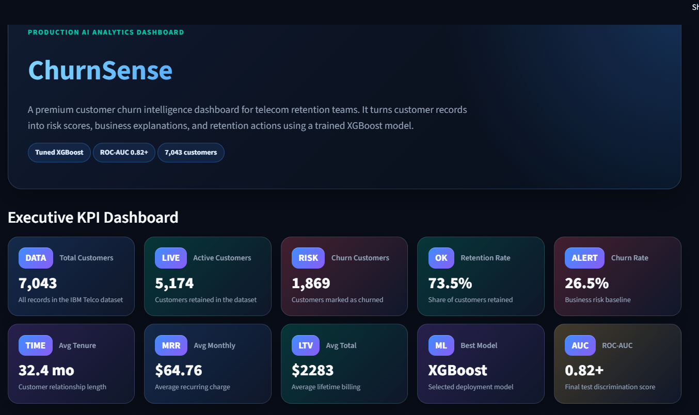
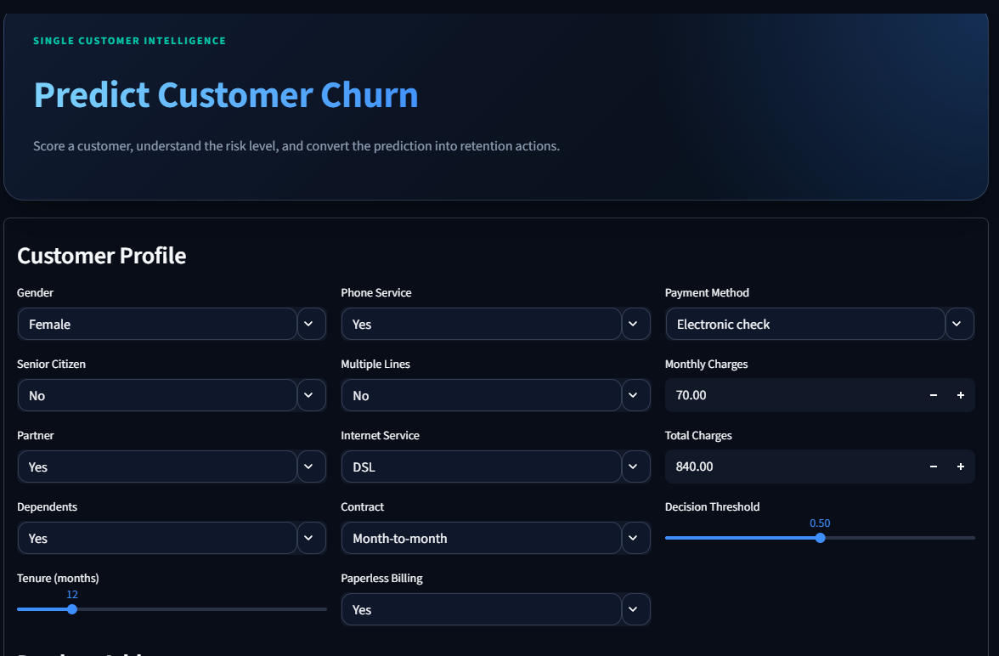
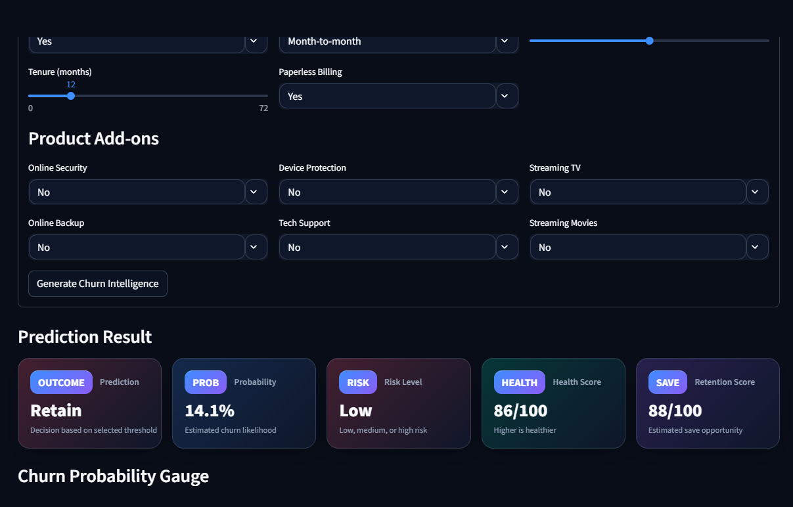
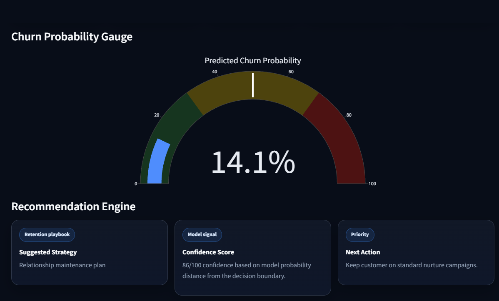
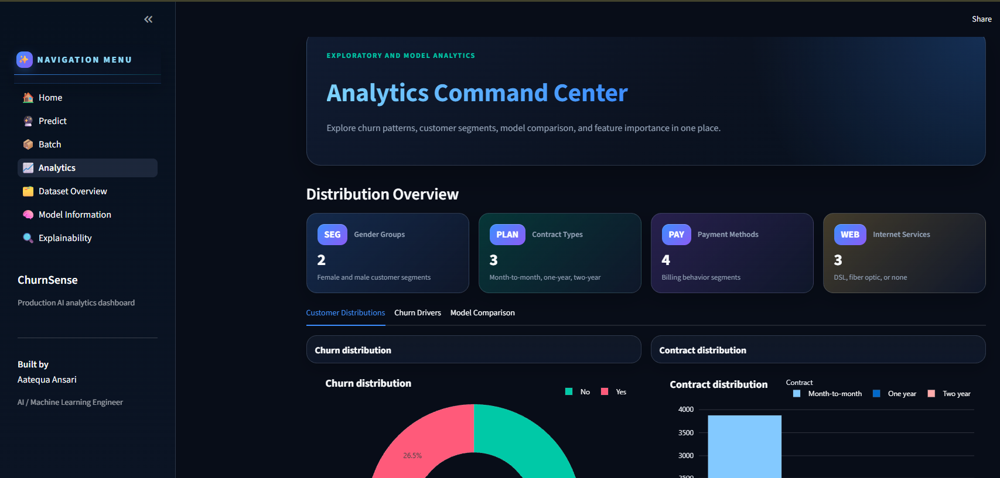
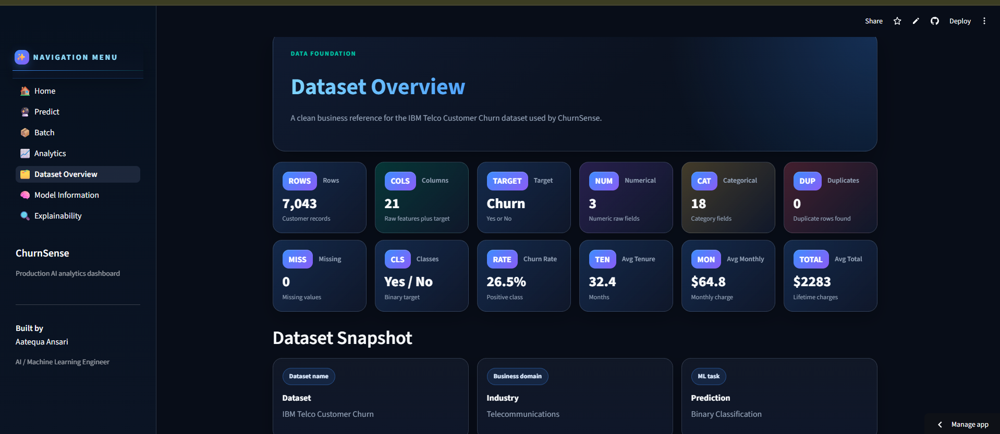
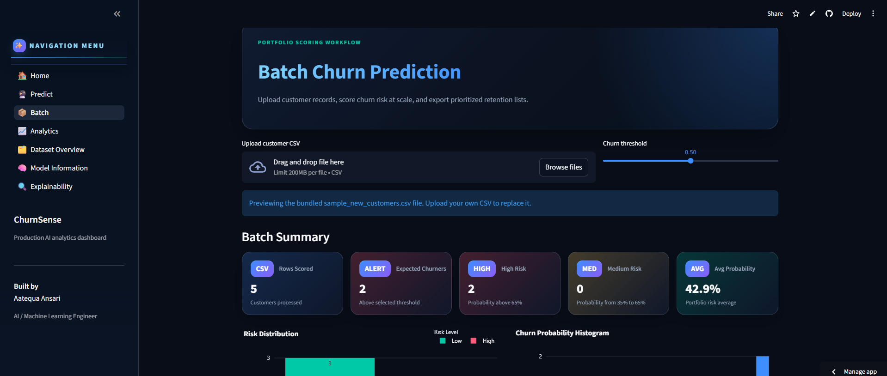
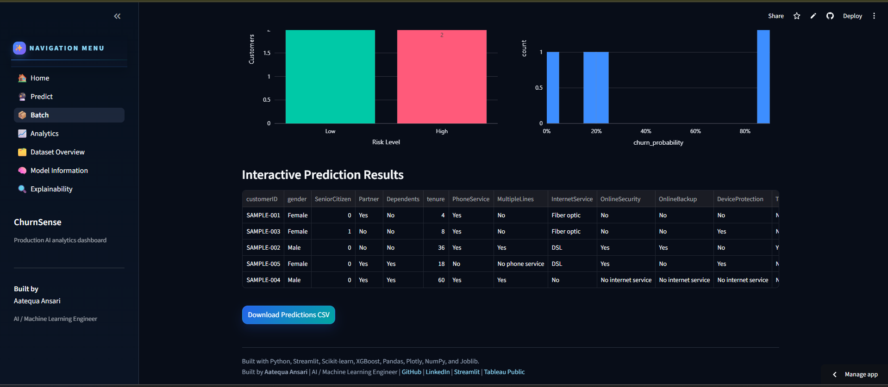
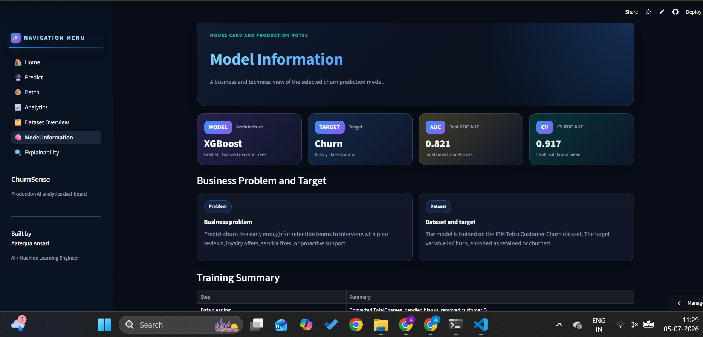
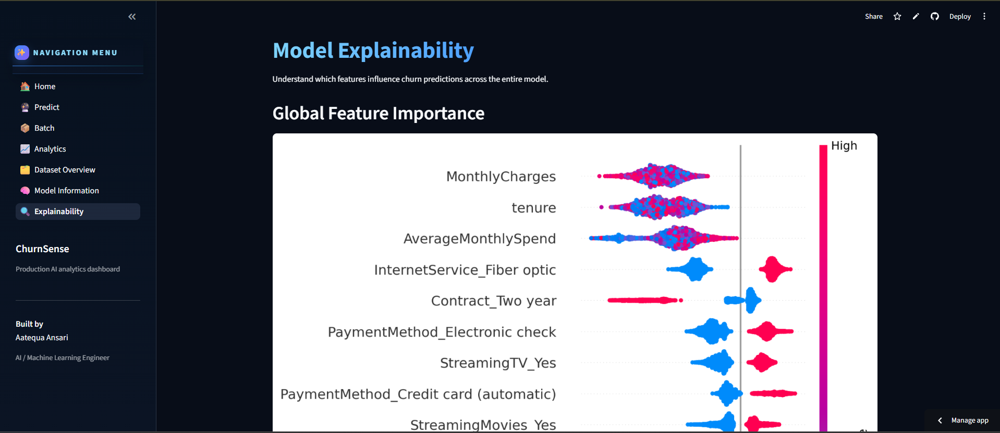

# 🚀 ChurnSense – AI-Powered Customer Churn Prediction System

<p align="center">


</p>

---

## 📌 Project Overview

[](https://churn-sense-aatequa-ansari.streamlit.app/)

[](https://github.com/Aatequa-Ansari)

**ChurnSense** is an end-to-end Machine Learning application that predicts customer churn in the telecommunications industry.

The project analyzes customer behavior, identifies customers who are likely to leave the company, explains the reasons behind each prediction using Explainable AI (SHAP), and provides actionable business recommendations through an interactive Streamlit dashboard.

The complete machine learning pipeline includes:

- Data Collection
- Exploratory Data Analysis (EDA)
- Data Cleaning & Preprocessing
- Feature Engineering
- Model Training & Hyperparameter Tuning
- Model Evaluation
- Explainable AI (SHAP)
- Business Recommendation Engine
- Interactive Streamlit Dashboard
- Batch Prediction
- Deployment Ready Project Structure

This project follows industry-standard machine learning practices and demonstrates how an ML model can be transformed into a production-ready business application.

---


# ✨ Features

ChurnSense provides a complete machine learning solution for telecom customer churn prediction with an interactive business dashboard.

## Machine Learning Features

- End-to-End Machine Learning Pipeline
- Data Cleaning & Preprocessing
- Feature Engineering
- Missing Value Handling
- Outlier Detection & Treatment
- Feature Scaling
- One-Hot Encoding
- Hyperparameter Tuning
- Cross Validation
- Explainable AI using SHAP

---

## Dashboard Features

- Interactive Streamlit Dashboard
- Single Customer Prediction
- Batch Customer Prediction
- Customer Risk Classification
- Churn Probability Gauge
- Health Score Calculation
- Retention Score Calculation
- Recommendation Engine
- SHAP Waterfall Explanation
- Customer Summary
- Business Analytics Dashboard

---

## Business Features

- Customer Risk Identification
- Customer Segmentation
- Churn Probability Estimation
- Retention Strategy Suggestions
- Actionable Business Recommendations
- Decision Support System
- Customer Health Monitoring
- Explainable Predictions

---


# 📸 Dashboard Preview

The Streamlit application provides an interactive interface for telecom customer churn analysis and prediction.

## 🏠 Home Dashboard




---

## 👤 Single Customer Prediction

### Customer Input



### Prediction Results



### SHAP Explanation & Recommendation



---


## 📊 Analytics Dashboard



---


## 📋 Dataset Overview



---


## 📂 Batch Prediction

### Upload CSV



### Batch Prediction Results



---


## 🤖 Model Information



---


## 🔍 Explainable AI (SHAP)



---


# 🏗️ System Architecture

The following diagram illustrates the complete machine learning workflow implemented in ChurnSense.

```text
                     IBM Telco Customer Churn Dataset
                                   │
                                   ▼
                    Exploratory Data Analysis (EDA)
                                   │
                                   ▼
                     Data Cleaning & Preprocessing
          ┌────────────────────────────────────────────┐
          │                                            │
          │ Missing Value Handling                     │
          │ Duplicate Removal                          │
          │ Outlier Detection                          │
          │ Feature Scaling                            │
          │ Categorical Encoding                       │
          └────────────────────────────────────────────┘
                                   │
                                   ▼
                          Feature Engineering
          ┌────────────────────────────────────────────┐
          │ Charges Per Month                          │
          │ Average Monthly Spend                      │
          │ Tenure Groups                              │
          │ High Value Customer                        │
          │ Additional Derived Features                │
          └────────────────────────────────────────────┘
                                   │
                                   ▼
                         Model Development
          ┌────────────────────────────────────────────┐
          │ Logistic Regression                        │
          │ Decision Tree                              │
          │ Random Forest                              │
          │ Gradient Boosting                          │
          │ XGBoost (Final Model)                      │
          └────────────────────────────────────────────┘
                                   │
                                   ▼
                           Model Evaluation
          ┌────────────────────────────────────────────┐
          │ Accuracy                                   │
          │ Precision                                  │
          │ Recall                                     │
          │ F1 Score                                   │
          │ ROC-AUC                                    │
          │ Cross Validation                           │
          └────────────────────────────────────────────┘
                                   │
                                   ▼
                         Explainable AI (SHAP)
                                   │
                                   ▼
                     Business Recommendation Engine
                                   │
                                   ▼
                   Interactive Streamlit Dashboard
```

---

## Workflow Summary

The project follows a complete end-to-end machine learning lifecycle beginning with raw customer data, followed by preprocessing, feature engineering, model training, evaluation, explainability, and finally deployment through an interactive Streamlit dashboard.

---


# 📂 Repository Structure

```text
ChurnSense/
│
├── 📁 app/
│   ├── 📄 streamlit_app.py              # Main Streamlit application
│   ├── 📄 home.py                       # Dashboard home page
│   ├── 📄 components.py                 # Reusable UI components
│   │
│   └── 📁 pages/
│       ├── 📄 01_predict.py             # Single customer prediction
│       ├── 📄 02_batch.py               # Batch prediction using CSV upload
│       ├── 📄 03_analytics.py           # Model evaluation dashboard
│       ├── 📄 04_dataset_overview.py    # Dataset insights
│       ├── 📄 05_model_information.py   # Model details and metrics
│       └── 📄 06_explainability.py      # SHAP Explainable AI dashboard
│
├── 📁 src/
│   ├── 📄 preprocessing.py              # Data preprocessing pipeline
│   ├── 📄 model.py                      # Model loading & prediction
│   ├── 📄 explainability.py             # SHAP explanation utilities
│   ├── 📄 recommendations.py            # Recommendation engine
│   ├── 📄 utils.py                      # Helper functions
│   └── 📄 __init__.py
│
├── 📁 data/
│   ├── 📄 WA_Fn-UseC_-Telco-Customer-Churn.csv
│   ├── 📄 processed_telco_churn.csv
│   ├── 📄 final_telco_churn.csv
│   └── 📄 sample_new_customers.csv
│
├── 📁 models/
│   ├── 📄 churn_prediction_model.pkl
│   ├── 📄 feature_columns.pkl
│   └── 📄 scaler.pkl
│
├── 📁 notebooks/
│   ├── 📓 01_eda.ipynb
│   ├── 📓 02_preprocessing.ipynb
│   ├── 📓 03_outlier_analysis.ipynb
│   └── 📓 04_model_building.ipynb
│
├── 📁 reports/
│   ├── 📊 EDA Charts
│   ├── 📊 Correlation Heatmaps
│   ├── 📊 Distribution Plots
│   └── 📊 Business Insight Visualizations
│
├── 📁 tests/
│   └── 📄 test_pipeline.py
│
├── 📄 MODEL_CARD.md
├── 📄 README.md
├── 📄 requirements.txt
├── 📄 runtime.txt
├── 📄 .gitignore
└── 📄 LICENSE
```

---

## Repository Highlights

- **Modular Architecture** for better maintainability.
- **Reusable preprocessing pipeline** shared across training and inference.
- **Production-ready project structure** following software engineering best practices.
- **Separation of concerns** between data, models, source code, and application.
- **Automated testing** for validating prediction pipelines.
- **Deployment-ready** with Streamlit-compatible configuration.

---


# 📊 Dataset Description

## Dataset Overview

ChurnSense is developed using the **IBM Telco Customer Churn Dataset**, a widely used benchmark dataset for binary classification and customer retention analysis.

The dataset contains demographic information, account details, subscribed services, billing information, and customer tenure, which are used to predict whether a customer is likely to discontinue the telecom service.

---

## Dataset Source

- **Dataset Name:** IBM Telco Customer Churn Dataset
- **Domain:** Telecommunications
- **Problem Type:** Binary Classification
- **Target Variable:** `Churn`
- **File Used:** `WA_Fn-UseC_-Telco-Customer-Churn.csv`

---

## Dataset Statistics

| Attribute | Value |
|-----------|------:|
| Total Records | 7,043 |
| Total Features | 21 |
| Target Classes | 2 |
| Problem Type | Binary Classification |
| Missing Values | Present in `TotalCharges` |
| Duplicate Records | None |
| Target Column | Churn |

---

## Input Features

The dataset consists of customer demographic information, subscription details, and billing information.

### Customer Information

- Gender
- Senior Citizen
- Partner
- Dependents

### Account Information

- Tenure
- Contract Type
- Paperless Billing
- Payment Method

### Services

- Phone Service
- Multiple Lines
- Internet Service
- Online Security
- Online Backup
- Device Protection
- Tech Support
- Streaming TV
- Streaming Movies

### Billing Information

- Monthly Charges
- Total Charges

---

## Target Variable

The target variable is **Churn**, which indicates whether a customer has discontinued the telecom service.

| Value | Meaning |
|-------|---------|
| Yes | Customer Churned |
| No | Customer Retained |

---

## Business Objective

The primary objective is to identify customers with a high probability of churning before they leave the service. This enables telecom companies to implement targeted retention strategies, reduce customer attrition, improve customer lifetime value, and minimize revenue loss.

---


# 🧹 Data Preprocessing & Feature Engineering

Real-world datasets are rarely clean and cannot be directly used for machine learning. A comprehensive preprocessing pipeline was implemented to transform the raw telecom dataset into a high-quality dataset suitable for model training.

---

## Data Cleaning

The following preprocessing steps were performed before model development:

### Missing Value Treatment

- Converted the `TotalCharges` column from string to numeric.
- Identified missing values resulting from blank entries.
- Replaced missing values using the median of the column to preserve the overall distribution.

---

### Duplicate Record Check

- Verified the dataset for duplicate customer records.
- No duplicate entries were found.

---

### Data Type Conversion

Several columns required conversion into appropriate data types before model training.

Examples include:

- TotalCharges → Float
- SeniorCitizen → Integer
- MonthlyCharges → Float
- Tenure → Integer

---

## Exploratory Data Analysis (EDA)

Comprehensive EDA was performed to better understand customer behavior and identify the key factors influencing churn.

The analysis included:

- Customer demographic analysis
- Service subscription analysis
- Contract type analysis
- Internet service analysis
- Payment method analysis
- Monthly charge distribution
- Tenure distribution
- Correlation analysis
- Target variable distribution

---

## Categorical Encoding

Since machine learning models require numerical input, categorical variables were transformed using One-Hot Encoding.

Examples:

| Original Feature | Encoded Features |
|------------------|------------------|
| Gender | Gender_Male |
| Contract | Contract_One year, Contract_Two year |
| InternetService | DSL, Fiber optic, No |
| PaymentMethod | Multiple encoded columns |

This approach prevents the model from assuming any ordinal relationship between categorical values.

---

## Feature Scaling

Numerical features were standardized before model training using **StandardScaler**.

Scaled features include:

- Tenure
- MonthlyCharges
- TotalCharges
- ChargesPerMonth
- AverageMonthlySpend

Feature scaling improves model stability and ensures that features with larger numerical ranges do not dominate the learning process.

---

# Feature Engineering

Several additional features were created to improve the predictive capability of the model.

| Engineered Feature | Description |
|-------------------|-------------|
| ChargesPerMonth | Ratio of TotalCharges to Tenure |
| AverageMonthlySpend | Average monthly customer spending |
| HighValueCustomer | Indicates customers with higher monthly spending |
| TenureGroup | Categorizes customers based on tenure duration |

These engineered features help capture hidden customer behavior patterns that are not directly available in the original dataset.

---

## Final Dataset

After preprocessing and feature engineering:

- Missing values were removed.
- Categorical variables were encoded.
- Numerical variables were standardized.
- New business-oriented features were created.
- The dataset was transformed into the final feature matrix used for model training.

The processed dataset was saved as:

```text
data/final_telco_churn.csv
```

---

## Benefits of the Preprocessing Pipeline

The preprocessing pipeline ensures:

- Improved data quality
- Better model generalization
- Reduced noise
- Consistent feature representation
- Reliable predictions during inference
- Reusable preprocessing for deployment

---


# 🤖 Model Development & Training

## Model Development Strategy

The objective of this project was to build a robust machine learning model capable of accurately predicting customer churn while maintaining a balance between predictive performance, interpretability, and computational efficiency.

Instead of relying on a single algorithm, multiple classification models were trained and evaluated to identify the best-performing solution.

---

## Machine Learning Algorithms Evaluated

The following supervised machine learning algorithms were implemented and compared:

| Algorithm | Purpose |
|-----------|---------|
| Logistic Regression | Baseline linear classification model |
| Decision Tree Classifier | Rule-based interpretable model |
| Random Forest Classifier | Ensemble learning using bagging |
| Gradient Boosting Classifier | Sequential boosting algorithm |
| XGBoost Classifier | Optimized gradient boosting algorithm (Final Model) |

Each model was trained using the same preprocessing pipeline to ensure a fair comparison.

---

## Model Training Pipeline

The complete model development workflow consisted of the following stages:

```text
Raw Dataset
      │
      ▼
Data Cleaning
      │
      ▼
Feature Engineering
      │
      ▼
One-Hot Encoding
      │
      ▼
Feature Scaling
      │
      ▼
Train-Test Split
      │
      ▼
Model Training
      │
      ▼
Hyperparameter Tuning
      │
      ▼
Cross Validation
      │
      ▼
Performance Evaluation
      │
      ▼
Final Model Selection
```

---

## Train-Test Split

The dataset was divided into separate training and testing subsets to evaluate model performance on unseen data.

- Training Set: 80%
- Testing Set: 20%
- Random State: Fixed for reproducibility

This ensures that the final evaluation reflects the model's ability to generalize to new customers.

---

## Hyperparameter Tuning

To improve predictive performance, hyperparameter tuning was performed on the candidate models.

The tuning process explored different combinations of parameters such as:

- Number of estimators
- Maximum tree depth
- Learning rate
- Minimum samples per split
- Minimum samples per leaf
- Subsample ratio
- Column sampling ratio

The optimal parameter combination was selected based on cross-validation performance.

---

## Cross Validation

A **5-Fold Cross Validation** strategy was used during model selection.

This approach provides a more reliable estimate of model performance by repeatedly training and validating the model on different subsets of the dataset.

Benefits include:

- Reduced overfitting
- Better generalization
- Stable performance estimation
- More reliable model comparison

---

## Final Model Selection

After comparing all candidate algorithms, **XGBoost Classifier** achieved the best overall performance.

The model demonstrated:

- High predictive accuracy
- Strong ROC-AUC score
- Better balance between Precision and Recall
- Robust performance across cross-validation folds
- Excellent generalization on unseen customer data

The trained model was saved for deployment and inference.

```text
models/
│
├── churn_prediction_model.pkl
├── feature_columns.pkl
└── scaler.pkl
```

---

## Why XGBoost?

XGBoost was selected because it offers several advantages over traditional machine learning algorithms:

- Excellent predictive performance
- Handles complex non-linear relationships
- Built-in regularization to reduce overfitting
- Efficient handling of missing values
- High scalability
- Fast training and inference
- Strong performance on structured tabular datasets

These characteristics make XGBoost one of the most widely adopted algorithms for real-world classification problems.

---

## Production Pipeline

The final deployed prediction pipeline follows these steps:

```text
User Input
      │
      ▼
Preprocessing
      │
      ▼
Feature Engineering
      │
      ▼
Feature Alignment
      │
      ▼
StandardScaler
      │
      ▼
XGBoost Prediction
      │
      ▼
Probability Score
      │
      ▼
Risk Classification
      │
      ▼
Business Recommendation
      │
      ▼
SHAP Explanation
```

This ensures that every prediction made through the Streamlit application follows the same preprocessing pipeline used during model training, resulting in consistent and reliable predictions.

---


# 📈 Model Evaluation & Performance

## Model Evaluation Strategy

To ensure that the selected model generalizes well to unseen customer data, multiple evaluation metrics were used instead of relying solely on accuracy.

A combination of classification metrics and probability-based metrics was used to assess the model's predictive performance.

---

## Final Model Performance

| Metric | Score |
|---------|-------:|
| Accuracy | **80.10%** |
| Precision | **65.16%** |
| Recall | **54.01%** |
| F1 Score | **59.06%** |
| ROC-AUC | **0.8280** |
| 5-Fold Cross Validation ROC-AUC | **0.9174** |

---

## Evaluation Metrics Explained

### Accuracy

Accuracy represents the percentage of correctly classified customers.

- Indicates the overall correctness of the model.
- Useful for obtaining a general understanding of performance.

**Formula**

```text
Accuracy = (TP + TN) / (TP + TN + FP + FN)
```

---

### Precision

Precision measures how many customers predicted as churners actually churned.

A higher precision reduces unnecessary retention costs.

**Formula**

```text
Precision = TP / (TP + FP)
```

---

### Recall

Recall measures how many actual churn customers were correctly identified.

A higher recall helps businesses retain more customers before they leave.

**Formula**

```text
Recall = TP / (TP + FN)
```

---

### F1 Score

The F1 Score balances Precision and Recall into a single metric.

It is particularly useful when dealing with imbalanced datasets.

**Formula**

```text
F1 = 2 × Precision × Recall / (Precision + Recall)
```

---

### ROC-AUC Score

The Receiver Operating Characteristic - Area Under Curve (ROC-AUC) evaluates how effectively the model separates churn and non-churn customers across different decision thresholds.

A higher ROC-AUC indicates stronger discrimination capability.

---

## Confusion Matrix Interpretation

The model predictions can be categorized into four outcomes:

| Prediction | Meaning |
|------------|---------|
| True Positive (TP) | Customer churned and was correctly predicted |
| True Negative (TN) | Customer stayed and was correctly predicted |
| False Positive (FP) | Customer predicted to churn but stayed |
| False Negative (FN) | Customer churned but was predicted to stay |

Reducing False Negatives is especially important because failing to identify customers who are about to churn may lead to direct revenue loss.

---

## Business Interpretation

The model is capable of identifying high-risk customers before they leave the telecom service.

This enables organizations to:

- Prioritize customer retention campaigns.
- Improve customer lifetime value.
- Reduce revenue loss due to churn.
- Allocate retention budgets more effectively.
- Support data-driven business decisions.

---

## Why ROC-AUC Was Prioritized

Although Accuracy is an important metric, ROC-AUC was selected as the primary evaluation metric because:

- The dataset is moderately imbalanced.
- Probability estimates are more informative than class labels.
- ROC-AUC measures ranking performance across all decision thresholds.
- It provides a better indication of how well the model distinguishes churners from retained customers.

---

## Model Strengths

- High discriminative capability.
- Robust cross-validation performance.
- Good balance between precision and recall.
- Suitable for deployment in customer retention workflows.
- Generates probability scores for risk-based decision making.

---

## Model Limitations

- Predictions depend on the quality of input customer data.
- Performance may decrease if customer behavior changes significantly over time.
- Periodic retraining is recommended to maintain predictive performance.

---


# 🧠 Explainable AI (SHAP)

## Why Explainable AI?

Accurate predictions alone are not sufficient for real-world business applications. Decision-makers need to understand **why** a customer has been classified as high-risk before taking action.

To improve transparency and trust, ChurnSense integrates **SHAP (SHapley Additive exPlanations)**, a state-of-the-art Explainable AI framework that explains individual model predictions.

Instead of treating the machine learning model as a black box, SHAP reveals how each feature contributes to the final churn probability.

---

# What is SHAP?

SHAP is based on **Shapley Values**, a concept from cooperative game theory.

Each feature is treated as a "player" contributing to the prediction.

The SHAP value measures how much each feature pushes the prediction:

- Towards **Customer Will Churn**
- Towards **Customer Will Stay**

Every prediction can therefore be decomposed into individual feature contributions.

---

# How SHAP Works

```text
Customer Data
        │
        ▼
Trained XGBoost Model
        │
        ▼
SHAP Explainer
        │
        ▼
Feature Contributions
        │
        ▼
Visual Explanation
```

---

# Local Explainability

For every customer prediction, SHAP calculates the contribution of each input feature.

Examples include:

- Contract Type
- Tenure
- Monthly Charges
- Internet Service
- Payment Method
- Online Security
- Tech Support

These contributions explain why a customer's churn probability increases or decreases.

---

# SHAP Waterfall Plot

The application generates an interactive **SHAP Waterfall Plot** for every prediction.

The visualization illustrates:

- Base prediction of the model.
- Features increasing churn probability.
- Features decreasing churn probability.
- Final predicted churn probability.

This enables users to understand the reasoning behind the prediction instead of relying solely on the output score.

---

# Interpretation of SHAP Values

| SHAP Value | Interpretation |
|------------|----------------|
| Positive | Increases churn probability |
| Negative | Decreases churn probability |
| Large Absolute Value | Strong influence on prediction |
| Small Absolute Value | Minimal influence on prediction |

---

# Example Interpretation

Suppose the model predicts a customer has an **83% probability of churn**.

SHAP may indicate:

| Feature | Contribution |
|----------|-------------|
| Month-to-Month Contract | Increased Risk |
| Fiber Optic Service | Increased Risk |
| Electronic Check Payment | Increased Risk |
| Low Tenure | Increased Risk |
| Tech Support | Reduced Risk |

Instead of simply predicting **"Will Churn"**, the model explains the reasoning behind the decision.

---

# Business Benefits of SHAP

Using Explainable AI provides several practical advantages:

- Improves transparency of model predictions.
- Builds trust with business stakeholders.
- Supports customer retention decision-making.
- Identifies key churn drivers for individual customers.
- Enables personalized retention strategies.
- Reduces reliance on black-box predictions.

---

# Why SHAP Was Selected

Several explainability techniques exist, including:

- Feature Importance
- LIME
- Partial Dependence Plots
- Permutation Importance

SHAP was selected because it:

- Provides consistent explanations.
- Supports both local and global interpretability.
- Is model-agnostic.
- Works efficiently with tree-based models such as XGBoost.
- Produces intuitive visualizations suitable for business users.

---

# Explainability Workflow

```text
Customer Input
        │
        ▼
Prediction
        │
        ▼
SHAP Explainer
        │
        ▼
Feature Contributions
        │
        ▼
Waterfall Plot
        │
        ▼
Business Interpretation
```

---

## Dashboard Integration

The Explainable AI module is fully integrated into the Streamlit application.

For every prediction, users can:

- View churn probability.
- Understand feature contributions.
- Analyze positive and negative drivers.
- Support retention decisions with transparent explanations.

This transforms the application from a predictive model into a complete AI-powered decision support system.

---


# 💼 Business Recommendation Engine

## Overview

Traditional machine learning applications usually stop after generating a prediction. ChurnSense extends this workflow by transforming model predictions into **actionable business recommendations**.

Instead of only predicting whether a customer is likely to churn, the system provides meaningful insights that help customer retention teams decide what actions should be taken.

The Recommendation Engine converts machine learning outputs into practical business intelligence.

---

# Recommendation Workflow

```text
Customer Information
          │
          ▼
 Machine Learning Prediction
          │
          ▼
 Churn Probability
          │
          ▼
 Risk Classification
          │
          ▼
 Customer Health Score
          │
          ▼
 Retention Score
          │
          ▼
 SHAP Explainability
          │
          ▼
 Personalized Recommendations
```

---

# Customer Health Score

The Customer Health Score estimates the overall relationship strength between the customer and the telecom company.

The score ranges from **0 to 100**.

| Score Range | Interpretation |
|-------------|----------------|
| 80 – 100 | Excellent Customer Health |
| 60 – 79 | Healthy Customer |
| 40 – 59 | Moderate Risk |
| 20 – 39 | High Risk |
| 0 – 19 | Critical Risk |

A higher Health Score indicates a lower likelihood of churn.

---

# Retention Score

The Retention Score estimates how likely a customer is to be successfully retained through proactive intervention.

This score helps business teams prioritize retention efforts based on customer value and predicted churn probability.

---

# Risk Classification

Based on the predicted churn probability, customers are automatically categorized into three risk levels.

| Risk Level | Probability Range |
|------------|-------------------|
| 🟢 Low Risk | 0% – 35% |
| 🟡 Medium Risk | 35% – 65% |
| 🔴 High Risk | Above 65% |

This segmentation allows organizations to allocate resources efficiently.

---

# Recommendation Categories

The system generates recommendations in several categories.

## Suggested Strategy

Provides an overall retention approach based on the customer's risk profile.

Examples include:

- Relationship Maintenance Plan
- Targeted Engagement Plan
- High-Touch Save Plan

---

## Risk Factors

The Recommendation Engine identifies business conditions that increase churn probability.

Examples include:

- Month-to-Month Contract
- High Monthly Charges
- Fiber Optic Internet Service
- Electronic Check Payment Method
- Short Customer Tenure

---

## Positive Factors

The application also highlights customer attributes that reduce churn risk.

Examples include:

- Long-Term Contract
- Long Customer Tenure
- Automatic Payment
- Lower Monthly Charges

---

## Next Best Action

Based on the prediction, the system recommends practical business actions such as:

- Contact the customer proactively.
- Offer loyalty discounts.
- Recommend contract upgrades.
- Promote automatic payment methods.
- Bundle additional services.
- Schedule follow-up interactions.

---

# Business Benefits

The Recommendation Engine enables organizations to:

- Prioritize high-risk customers.
- Reduce customer churn.
- Improve customer lifetime value.
- Optimize retention budgets.
- Support data-driven decision making.
- Deliver personalized customer engagement strategies.

---

# Business Value

By combining Machine Learning, Explainable AI, and a Recommendation Engine, ChurnSense becomes more than a prediction tool—it functions as an **AI-powered customer retention decision support system** that helps businesses take informed, proactive actions.

---


# 🖥️ Interactive Dashboard Modules

## Overview

ChurnSense provides a modern, interactive, multi-page Streamlit dashboard that transforms machine learning predictions into actionable business intelligence.

The dashboard is designed for business analysts, customer retention teams, and decision-makers, providing an intuitive interface for prediction, analytics, explainability, and customer risk assessment.

---

# Dashboard Architecture

```text
                      ChurnSense Dashboard
                              │
    ┌──────────────┬───────────┼───────────┬──────────────┐
    │              │           │           │              │
    ▼              ▼           ▼           ▼              ▼
 Home        Prediction     Batch      Analytics    Model Info
 Dashboard     Module      Prediction    Dashboard
    │
    ▼
Explainability
```

---

# 🏠 Home Dashboard

The Home Dashboard serves as the landing page of the application and provides a comprehensive overview of customer churn analytics.

### Key Features

- Executive KPI Dashboard
- Customer Statistics
- Churn Distribution
- Retention Rate
- Business Summary
- Interactive Charts
- Project Workflow
- Quick Navigation
- Modern Enterprise UI

---

# 🔮 Single Customer Prediction

The Prediction module enables users to estimate the churn probability of an individual customer.

### Input Parameters

- Customer Demographics
- Account Information
- Contract Details
- Internet Services
- Billing Information
- Additional Service Subscriptions

### Output

- Churn Prediction
- Churn Probability
- Risk Level
- Customer Health Score
- Retention Score
- Confidence Score
- Suggested Strategy
- Next Best Action
- SHAP Explanation
- Customer Summary

---

# 📂 Batch Prediction

The Batch Prediction module supports predictions for multiple customers simultaneously.

Users can upload a CSV file containing customer records.

The system automatically:

- Validates the uploaded dataset
- Applies preprocessing
- Generates predictions
- Calculates churn probabilities
- Assigns risk levels
- Generates recommendations
- Allows downloading prediction results

This functionality is particularly useful for customer retention campaigns.

---

# 📈 Analytics Dashboard

The Analytics module provides interactive visualizations for model evaluation and business insights.

### Included Analytics

- Model Performance Metrics
- Confusion Matrix
- ROC Curve
- Precision-Recall Curve
- Feature Importance
- Churn Distribution
- Contract Analysis
- Payment Method Analysis
- Internet Service Analysis

These visualizations help stakeholders better understand customer behavior and model performance.

---

# 📊 Dataset Overview

The Dataset Overview page provides detailed information about the dataset used for model development.

It includes:

- Dataset Statistics
- Data Quality Assessment
- Feature Dictionary
- Dataset Composition
- Customer Explorer
- Interactive Filters
- Download Dataset
- Business Description

---

# 🤖 Model Information

The Model Information page documents the machine learning pipeline and model characteristics.

Included information:

- Model Architecture
- Selected Algorithm
- Performance Metrics
- Training Process
- Hyperparameter Tuning
- Model Strengths
- Model Limitations
- Production Considerations

---

# 🧠 Explainability Dashboard

The Explainability module improves transparency by explaining every prediction using SHAP.

Users can understand:

- Feature Contributions
- Positive Drivers
- Negative Drivers
- Waterfall Plot
- Prediction Reasoning
- Customer-Level Interpretability

This helps business teams make informed decisions instead of relying solely on prediction scores.

---

# Dashboard Highlights

✔ Multi-Page Architecture

✔ Responsive User Interface

✔ Interactive Visualizations

✔ Business-Oriented Design

✔ Explainable Predictions

✔ Downloadable Results

✔ Production-Ready Structure

✔ Modular Components

✔ Enterprise Dashboard Experience

---

# Business Impact

The interactive dashboard bridges the gap between machine learning and business decision-making by transforming predictive analytics into practical customer retention strategies.

Instead of simply predicting customer churn, the application enables organizations to understand customer behavior, identify high-risk accounts, and take proactive actions to improve customer retention.

---


# ⚙️ Installation & Getting Started

## System Requirements

Before running the project, ensure the following software is installed on your system.

| Software | Recommended Version |
|-----------|--------------------|
| Python | 3.10 or later |
| Git | Latest |
| pip | Latest |
| VS Code (Optional) | Latest |

---

# Clone the Repository

Clone the GitHub repository to your local machine.

```bash
git clone https://github.com/Aatequa-Ansari/churn-sense.git

cd ChurnSense
```


---

# Create a Virtual Environment

Creating a virtual environment is recommended to isolate project dependencies.

### Windows

```bash
python -m venv venv

venv\Scripts\activate
```

### Linux / macOS

```bash
python3 -m venv venv

source venv/bin/activate
```

---

# Install Dependencies

Install all required Python packages.

```bash
pip install --upgrade pip

pip install -r requirements.txt
```

---

# Verify Installation

Check that Streamlit is installed correctly.

```bash
streamlit --version
```

---

# Project Structure

After installation, your project should look like:

```text
ChurnSense/
│
├── app/
├── src/
├── data/
├── models/
├── notebooks/
├── reports/
├── tests/
├── README.md
├── requirements.txt
└── runtime.txt
```

---

# Run the Streamlit Application

Start the dashboard using:

```bash
streamlit run app/streamlit_app.py
```

Once the application starts successfully, open the URL displayed in the terminal.

Typically:

```text
http://localhost:8501
```

---

# Running Unit Tests

Run all project tests using:

```bash
pytest tests/ -v
```

The tests validate:

- Model loading
- Preprocessing pipeline
- Feature alignment
- Prediction pipeline
- Batch prediction workflow

---

# Sample Batch Prediction

A sample input file is included for testing.

```text
data/sample_new_customers.csv
```

Upload this file through the **Batch Prediction** page to verify the complete prediction pipeline.

---

# Troubleshooting

## ModuleNotFoundError

If a package is missing:

```bash
pip install -r requirements.txt
```

---

## Streamlit Command Not Found

Run:

```bash
python -m streamlit run app/streamlit_app.py
```

---

## Model File Not Found

Verify the following files exist inside the `models` directory:

```text
models/
├── churn_prediction_model.pkl
├── feature_columns.pkl
└── scaler.pkl
```

---

## Application Does Not Start

Ensure:

- Python version is compatible.
- Virtual environment is activated.
- All dependencies are installed.
- Required model files are available.

---

# Deployment Ready

The project is fully configured for deployment using **Streamlit Community Cloud**.

Required deployment files include:

- `requirements.txt`
- `runtime.txt`
- `.streamlit/config.toml`

No additional configuration is required beyond connecting the GitHub repository to Streamlit Community Cloud.

---


# ☁️ Deployment

## Deployment Overview

ChurnSense has been designed as a production-ready Machine Learning application and can be deployed on **Streamlit Community Cloud** directly from a GitHub repository.

The deployed application provides an interactive web interface for customer churn prediction, business analytics, explainable AI, and batch prediction without requiring any local setup.

---

## Deployment Architecture

```text
                     GitHub Repository
                             │
                             ▼
                 Streamlit Community Cloud
                             │
                             ▼
                  Streamlit Application
                             │
        ┌────────────────────┼────────────────────┐
        │                    │                    │
        ▼                    ▼                    ▼
 Single Prediction     Batch Prediction     Analytics
        │                    │                    │
        └────────────────────┼────────────────────┘
                             ▼
                      XGBoost Model
                             │
                             ▼
                    SHAP Explainability
                             │
                             ▼
                  Business Recommendations
```

---

## Deployment Requirements

The application includes all required deployment files:

- `requirements.txt`
- `runtime.txt`
- `.streamlit/config.toml`

These files ensure compatibility with Streamlit Community Cloud.

---

## Live Demo

> **Application URL**

```text
https://churn-sense-aatequa-ansari.streamlit.app/
```


---

## GitHub Repository

```text
https://github.com/Aatequa-Ansari/churn-sense
```


---

## Deployment Checklist

- GitHub Repository Created
- Streamlit Configuration Added
- Dependencies Listed
- Model Files Uploaded
- Dataset Included
- Application Tested
- Ready for Public Deployment

---


# 🛠️ Technology Stack

| Category | Technologies |
|-----------|--------------|
| Programming Language | Python |
| Machine Learning | Scikit-Learn, XGBoost |
| Explainable AI | SHAP |
| Data Analysis | Pandas, NumPy |
| Data Visualization | Matplotlib, Plotly |
| Dashboard | Streamlit |
| Model Serialization | Joblib |
| Testing | Pytest |
| Version Control | Git & GitHub |
| Development Environment | VS Code, Jupyter Notebook |
| Deployment | Streamlit Community Cloud |

---

## Machine Learning Concepts

- Binary Classification
- Feature Engineering
- Data Preprocessing
- One-Hot Encoding
- Feature Scaling
- Hyperparameter Tuning
- Cross Validation
- Explainable AI
- Business Intelligence
- Customer Analytics

---


# 🚀 Future Enhancements

The following improvements are planned for future versions of ChurnSense.

## Machine Learning

- Model Monitoring
- Automatic Model Retraining
- Drift Detection
- Ensemble Learning
- AutoML Integration

---

## Backend

- FastAPI Integration
- REST API Endpoints
- Authentication System
- User Management
- Database Integration

---

## Deployment

- Docker Containerization
- Kubernetes Deployment
- AWS Cloud Deployment
- Azure Deployment
- CI/CD Pipeline using GitHub Actions

---

## Dashboard

- Dark / Light Theme Toggle
- Real-Time Prediction History
- Customer Segmentation Dashboard
- Interactive Report Generation
- PDF Report Export

---

## Business Intelligence

- Customer Lifetime Value Prediction
- Customer Segmentation
- Upselling Recommendation System
- Churn Trend Forecasting
- Executive Dashboard

---


# 👩‍💻 Author

## Developed By

# **Aatequa Ansari**

**AI Engineer | Machine Learning Engineer | Data Scientist**

Passionate about building intelligent systems that combine Machine Learning, Explainable AI, and Business Intelligence to solve real-world problems.

---

### Areas of Interest

- Machine Learning
- Artificial Intelligence
- Explainable AI
- Computer Vision
- Deep Learning
- Data Analytics
- Business Intelligence
- MLOps

---

### Connect With Me

**GitHub**

> https://github.com/Aatequa-Ansari

**LinkedIn**

> https://www.linkedin.com/in/aatequa-ansari-873639326/

**Email**

> aatequaansari12@gamil.com

---

If you found this project helpful, consider giving it a ⭐ on GitHub.

Feedback, suggestions, and contributions are always welcome.

---


# 📄 License

This project is licensed under the **MIT License**.

You are free to use, modify, and distribute this project for educational and research purposes, provided that proper attribution is given.


---

## Acknowledgements

This project was developed as part of an **Applied Data Science & Machine Learning Internship**.

Special thanks to:

- IoT Academy
- IBM for the Telco Customer Churn Dataset
- The open-source Python community
- Streamlit
- Scikit-Learn
- XGBoost
- SHAP

---

### ⭐ If you found this project useful, please consider starring the repository.

Thank you for visiting the project!

**Happy Learning!**